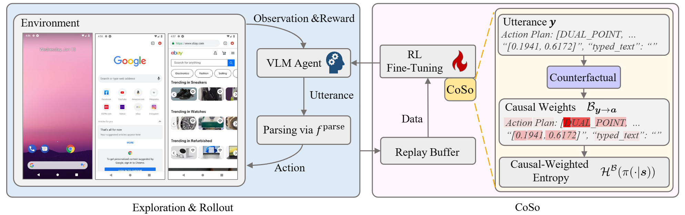

<!-- <p align="center">
    
</p> -->

<h2 align="center">
Towards Efficient Online Tuning of VLM Agents via Counterfactual Soft Reinforcement Learning
</h2>

<p align="center">
  <b>ICML 2025</b>
  <br>
  <a href="https://langfengq.github.io/">Lang Feng</a>,
  <a href="https://weihaotan.github.io/">Weihao Tan</a>,
  <a href="https://scholar.google.com.hk/citations?user=OJBfthMAAAAJ&hl=zh-CN">Zhiyi Lyu</a>,
  <a href="https://ltzheng.github.io/">Longtao Zheng</a>,
  <a href="https://scholar.google.com/citations?user=qZYvce8AAAAJ&hl=en">Haiyang Xu</a>,
  <a href="https://scholar.google.com/citations?user=uIUfGxYAAAAJ&hl=zh-CN">Ming Yan</a>,
  <a href="https://scholar.google.com/citations?user=9r98PpoAAAAJ&hl=en">Fei Huang</a>,
  <a href="https://personal.ntu.edu.sg/boan/">Bo An</a>
  <br>
  Nanyang Technological University & Alibaba Group
</p>


<p align="center">
  <a href="https://arxiv.org/abs/2505.03792"></a>
  &nbsp;
  <a href="https://github.com/langfengQ/CoSo"></a>
</p>

<p align="center">
  
</p>
<p align="center"><em>Overview of the CoSo training workflow.</em></p>


## Table of Contents

- [Installation](#installation)
  - [Option 1: Using Docker (Recommended)](#option-1-using-docker-recommended)
  - [Option 2: Using Conda (4 Steps)](#option-2-using-conda-4-steps)
- [Configuration](#configuration)
- [Run Examples](#run-examples)
  - [1. Run CoSo](#1-run-coso)
  - [2. Run Naive Entropy](#2-run-naive-entropy)
  - [3. Run DigiRL Baseline](#3-run-digirl-baseline)
- [Citation](#citation)


## Installation

### (Option 1) Using Docker (Recommended)
Fast and isolated setup using the provided `Dockerfile`.
```bash
docker build -t coso .

docker run --name coso --gpus all --device /dev/kvm --group-add kvm --shm-size 2gb -it -v <repo_path>/CoSo:<repo_path>/CoSo coso
```
Installation is complete! Skip to [Configuration](#configuration).

### (Option 2) Using Conda (4 Steps)
### 1. Create the Environment and Install Dependencies
```bash
conda create -n coso python==3.10
conda activate coso

git clone https://github.com/langfengQ/CoSo.git
cd CoSo
pip install -e .
```

### 2. Environment Setup
The environment setup follows the same procedure as [DigiRL](https://github.com/DigiRL-agent/digirl). Please refer to [the environment README](./env_setup/README.md). Before moving on, you should be able to view [this screenshot](./assets/screenshot.png) by running [this script](./env_setup/screenshot.py).


### 3. Download Model Checkpoints
Download the model:

```bash
wget https://huggingface.co/cooelf/Auto-UI/resolve/main/Auto-UI-Base.zip
unzip Auto-UI-Base.zip -d <path_to_autoui_dir>
```

The folder should contain:

```
Auto-UI-Base/
├── config.json
├── pytorch_model.bin
├── tokenizer.json
...
```

### 4. Pre-Collected Trajectories

Download from [Google Drive](https://drive.google.com/drive/folders/1ud1XyzCfh0257CixxdgLjjpX59jYbhfU?usp=sharing):

| File Name                                | #Trajectories | Horizon | Size    |
| ---------------------------------------- | ------------- | ------- | ------- |
| general-off2on-sft-trajectories.pt  | 608           | 10      | 95.5MB  |
| general-offline-sft-trajectories.pt | 1552          | 10      | 243.9MB |
| webshop-off2on-sft-trajectories.pt  | 528           | 20      | 115.2MB |
| webshop-offline-sft-trajectories.pt | 1296          | 20      | 297.5MB |

Store the files in path `~/data/`:

```bash
mkdir ~/data
cp *.pt ~/data/
```

## Configuration

- Edit the configuration file: [scripts/config/main/default.yaml](./scripts/config/main/default.yaml):

    1. Fill in API keys and project info:
        ```
        huggingface_token: ''
        wandb_key: ''
        gemini_key: ''

        entity_name: ''
        project_name: ''
        ```

    2. Define the asset path:
        ```
        assets_path: '<repo_path>/CoSo/digirl/environment/android/assets/task_set'
        ```

    3. (Only if using conda) Replace /root/ with your own paths:
        ```
        policy_lm: '/root/Auto-UI-Base'
        cache_dir: '/root/.cache'
        ```

- Edit the sub-configuration file
    1. Choose the appropriate sub-configuration depending on training mode:`digirl_off2on` or `digirl_offline.yaml` or `digirl_online.yaml` or `eval_only`

    2. (Only if using conda) Replace /root/ with your own paths:
        ```
        offline_data_path: "/root/data/webshop-off2on-sft-trajectories.pt"
        ```

<!-- Configuration:
* Modify `scripts/config/main/default.yaml`.
* Fill in values for all placeholders (e.g., `huggingface_token`, `wandb_token`, `gemini_token`, etc.)
* Choose the appropriate sub-configuration depending on training mode:
  * `digirl_off2on`
  * `digirl_offline.yaml`
  * `digirl_online.yaml`
  * `eval_only` -->

## Run Examples
### 1. Run CoSo
`use_entropy` and `use_causal` are set to `True` in the [default.yaml](./scripts/config/main/default.yaml).
```bash
use_entropy: True
use_causal: True
```
Then run CoSo via:
```bash
cd scripts
python run.py --config-path config/main --config-name digirl_off2on
```

### 2. Run Naive Entropy
Modify [default.yaml](./scripts/config/main/default.yaml):
```bash
use_entropy: True
use_causal: False
```
### 3. Run DigiRL Baseline
Modify [default.yaml](./scripts/config/main/default.yaml):
```bash
use_entropy: False
use_causal: False
```
<!-- ### Main Results Reproduction

To reproduce the results in Table 1 of our paper, first download the corresponding checkpoints as described above. As the results in the training set are obtained by randomly sampling tasks, we recommend reproducing the test results (which are obtained by sequentially sampling the first 96 trajectories).

To do this, modify the [`eval_only.yaml`](https://github.com/DigiRL-agent/digirl/blob/master/scripts/config/main/default.yaml) config file and its parent ['default.yaml'](https://github.com/DigiRL-agent/digirl/blob/master/scripts/config/main/default.yaml) config file to experiment settings. For instance, you can modify these configs for reproduction:

1. `default.yaml`
    1. Set `task_split: "test"` and `eval_sample_mode: "sequential"`
    2. Don't forget to increase `max_steps` to `20` if `task_set` is set to `webshop` (as the webshop tasks usually need more steps than the general tasks to complete).
2. `eval_only.yaml`
    1. Make sure `rollout_size` (in `default.yaml`) * `eval_iterations` (in `eval_only.yaml`) = 96. For example, `rollout_size (16) * eval_iterations (6) = 96`. -->

## Citation
If you find this code and CoSo useful in your research or applications, we would appreciate it if you could cite our work:
```
@article{feng2025towards,
  title={Towards Efficient Online Tuning of VLM Agents via Counterfactual Soft Reinforcement Learning},
  author={Feng, Lang and Tan, Weihao and Lyu, Zhiyi and Zheng, Longtao and Xu, Haiyang and Yan, Ming and Huang, Fei and An, Bo},
  journal={arXiv preprint arXiv:2505.03792},
  year={2025}
}
```
